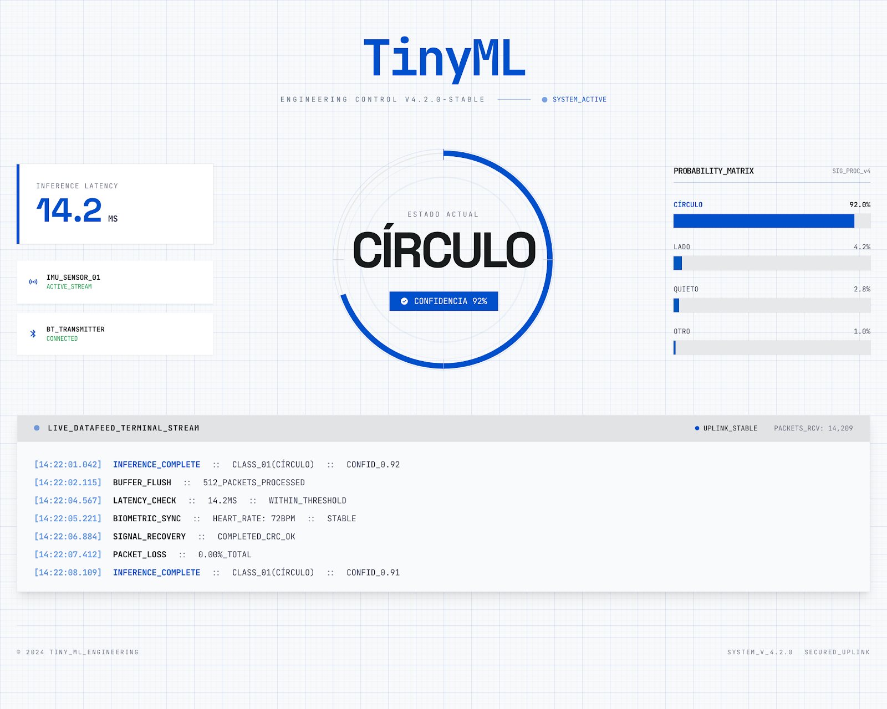

<div align="center">

# TinyML Gesture Classification

**Real-time motion recognition on the edge — from IMU sensor to web dashboard over BLE.**

[](https://docs.python.org/3/)
[](https://www.tensorflow.org/api_docs)
[](https://www.tensorflow.org/lite/guide)
[](https://docs.arduino.cc/hardware/nano-33-ble-sense-rev2/)
[](https://scikit-learn.org/stable/user_guide.html)
[](https://bleak.readthedocs.io/en/latest/)
[](https://websockets.readthedocs.io/en/stable/)
[](https://tailwindcss.com/docs)
[](./LICENSE)
[](eval/model_comparison.md)
[](models/cnn/)
[](arduino/)



</div>

---

## Overview

This project implements a **complete end-to-end TinyML pipeline** for classifying human gestures in real time. A 1D CNN model (27.5 KB, INT8) runs directly on an **Arduino Nano 33 BLE Sense Rev2**, reading 6-axis IMU data (accelerometer + gyroscope) and broadcasting inference results via Bluetooth Low Energy to a Python bridge and a live web dashboard.

```
┌──────────────────────┐   BLE GATT   ┌─────────────────┐  WebSocket  ┌─────────────────────┐
│  Arduino Nano 33 BLE │  ──────────► │  Python Bridge  │ ──────────► │   Web Dashboard     │
│  ─────────────────── │              │  ble_bridge.py  │             │   dashboard/        │
│  BMI270 IMU (100 Hz) │              │  localhost:8765  │             │   Real-time UI      │
│  CNN 1D (26.9 KB)    │              └─────────────────┘             └─────────────────────┘
│  INT8 TFLite Micro   │
└──────────────────────┘
```

### Gesture Classes

| Class | Description |
|---|---|
| `CIRCULO` | Circular wrist motion |
| `LADO` | Lateral side-to-side motion |
| `QUIETO` | Device at rest |
| `DEFAULT` | Any other movement |

---

## Performance

| Model | Format | Size | Accuracy | Latency |
|---|---|---|---|---|
| CNN 1D | Float32 TFLite | 52.1 KB | **97.93%** | ~14 ms |
| CNN 1D | INT8 TFLite | **26.9 KB** | **97.59%** | ~14 ms |
| Random Forest | C++ header (no TFLite) | 576 KB¹ | 94.03% | **<1 ms** |
| Logistic Regression | C++ header (no TFLite) | **4.8 KB** | 90.85% | **<0.1 ms** |
| Gaussian Naive Bayes | C++ header (no TFLite) | 8.7 KB | 63.93% | **<0.1 ms** |
| Linear SVM | C++ header (no TFLite) | **4.8 KB** | 91.36% | **<0.1 ms** |
| RBF SVM | C++ header (no TFLite) | ~40–70 KB² | *pending* | **<2 ms** |

> CNN INT8 quantization reduces model size by **48%** with only **0.34 pp** accuracy loss.
>
> ¹ `model_rf.h` is 576 KB of C++ source text; compiled to ARM Thumb2 it is ~80–120 KB.
> Without the TFLite Micro library (~200 KB), the RF firmware has a smaller total flash footprint than the CNN.
>
> The Logistic Regression model serves as the **linear baseline**: its 90.85% accuracy confirms that the classification problem has a significant non-linear component that justifies the added complexity of RF and CNN.
>
> Gaussian Naive Bayes achieves only 63.93% — 58% of `LADO` samples are misclassified as `CIRCULO` — confirming that the conditional independence assumption is severely violated by the highly correlated IMU axes.
>
> ² `model_svm_rbf.h` size depends on the number of support vectors (~200–600 expected). Run `python training/train_svm_rbf.py` to generate; estimated accuracy 94–97% (see `docs/model_viability_analysis.md`).

---

## Repository Structure

```
.
├── arduino/
│   ├── tinyml_ble_cnn/        # CNN inference firmware (.ino + model_cnn.h)
│   └── tinyml_ble_rf/         # Random Forest inference firmware (.ino + model_rf.h)
├── bridge/
│   ├── ble_bridge.py          # BLE → WebSocket relay (Python)
│   └── requirements.txt
├── dashboard/
│   └── index.html             # Real-time web dashboard (Tailwind + Vanilla JS)
├── data_collection/
│   ├── capture.py             # BLE data capture script
│   ├── gui.py                 # Tkinter GUI for capture sessions
│   ├── recoleccion.ino        # Data collection Arduino firmware
│   └── requirements.txt
├── docs/
│   ├── technical_report.md    # Architecture decisions, bugs, and solutions
│   ├── model_viability_analysis.md  # Viability analysis for all candidate models
│   └── design.md              # Design system specification
├── eval/
│   ├── cnn/                   # CNN evaluation plots and confusion matrices
│   ├── rf/                    # Random Forest evaluation plots and feature importance
│   ├── lr/                    # Logistic Regression evaluation plots and coefficients
│   ├── nb/                    # Gaussian Naive Bayes evaluation plots and class means
│   ├── svm_l/                 # Linear SVM evaluation plots and coefficients
│   ├── svm_rbf/               # RBF SVM evaluation plots and support vector distribution
│   └── model_comparison.md    # Side-by-side model analysis
├── models/
│   ├── cnn/                   # CNN model artifacts (Keras, TFLite, scaler params)
│   ├── rf/                    # Random Forest artifacts (model_rf.h, predictions, importance)
│   ├── lr/                    # Logistic Regression artifacts (model_lr.h, scaler_params_lr.json)
│   ├── nb/                    # Gaussian Naive Bayes artifacts (model_nb.h, predictions)
│   ├── svm_l/                 # Linear SVM artifacts (model_svm_linear.h, scaler_params_svm_linear.json)
│   └── svm_rbf/               # RBF SVM artifacts (model_svm_rbf.h, scaler_params_svm_rbf.json)
├── training/
│   ├── train_cnn.py           # CNN training pipeline
│   ├── train_rf.py            # Random Forest training + C++ export (micromlgen)
│   ├── train_lr.py            # Logistic Regression training + C++ export (micromlgen)
│   ├── train_nb.py            # Gaussian Naive Bayes training + C++ export (micromlgen)
│   ├── train_svm_linear.py    # Linear SVM training + C++ export (micromlgen via proxy)
│   ├── train_svm_rbf.py       # RBF SVM training + C++ export (micromlgen)
│   ├── eda.py                 # Exploratory Data Analysis
│   ├── calc_scaler.py         # Global scaler computation for firmware
│   ├── data/                  # Raw IMU recordings (6 subjects × ~60 sessions)
│   └── requirements.txt
├── requirements.txt           # Full project dependencies
└── LICENSE
```

---

## Quick Start

### Prerequisites

- Python 3.10+
- Arduino IDE 2.x with the `Arduino_BMI270_BMM150` and `ArduinoBLE` libraries installed
- An **Arduino Nano 33 BLE Sense Rev2**
- macOS / Linux (Windows requires adjusting the BLE backend)

### 1. Install Python Dependencies

```bash
pip install -r requirements.txt
```

### 2. Flash the Arduino Firmware

1. Open `arduino/tinyml_ble_cnn/tinyml_ble_cnn.ino` in the Arduino IDE.
2. Ensure `model_cnn.h` is in the same folder (it is — it's auto-generated and committed).
3. Select **Arduino Nano 33 BLE** as the target board and flash.

### 3. Start the BLE Bridge

```bash
python bridge/ble_bridge.py
```

The bridge scans by BLE `SERVICE_UUID`, connects to the Arduino, and re-broadcasts payloads on `ws://localhost:8765`.

### 4. Open the Dashboard

Open `dashboard/index.html` in any modern browser. The dashboard connects to the local WebSocket server and renders real-time inference results.

---

## Training Pipeline

The training pipeline ingests multi-subject IMU recordings, applies sliding-window segmentation, fits a StandardScaler, and exports a quantized TFLite model.

### Data Format

Each CSV recording has the following columns:

```
timestamp_ms, ax, ay, az, gx, gy, gz
```

Recordings are organized under `training/data/<Subject>/` at 100 Hz.

### Windowing Strategy

| Parameter | Value | Rationale |
|---|---|---|
| Window size | 100 samples | 1000 ms — sufficient for full gesture cycle (Banos et al., 2014) |
| Step size | 50 samples | 50% overlap for augmentation and continuity |
| Sampling rate | 100 Hz | BMI270 FIFO output data rate |

### Run Training

```bash
# Exploratory data analysis
python training/eda.py

# Train CNN (recommended — INT8 TFLite, 26.9 KB)
python training/train_cnn.py

# Train Random Forest (no TFLite — exports model_rf.h for Arduino)
python training/train_rf.py

# Train Logistic Regression (linear baseline — exports model_lr.h for Arduino)
python training/train_lr.py

# Train Gaussian Naive Bayes (minimum complexity reference — exports model_nb.h)
python training/train_nb.py

# Train Linear SVM (maximum-margin linear classifier — exports model_svm_linear.h)
python training/train_svm_linear.py

# Train RBF SVM (best classical model candidate — exports model_svm_rbf.h)
python training/train_svm_rbf.py

# Recompute scaler constants for CNN firmware
python training/calc_scaler.py
```

Outputs are written to `models/cnn/`, `models/rf/`, and `models/lr/` respectively.

### CNN Architecture

```
Input (100, 6)
  └── Conv1D(16, kernel=3, relu)
  └── Conv1D(32, kernel=3, relu)
  └── Conv1D(64, kernel=3, relu)
  └── GlobalAveragePooling1D
  └── Dense(32, relu)
  └── Dense(4, softmax)       ← 4 gesture classes
```

Training uses `Adam(lr=1e-3)` with `EarlyStopping(patience=15)` and balanced class weights to handle the underrepresented `DEFAULT` class.

---

## Data Collection

Use the Tkinter GUI to capture new gesture recordings:

```bash
python data_collection/gui.py
```

Or run the headless capture script:

```bash
python data_collection/capture.py
```

Both tools connect to an Arduino flashed with `data_collection/recoleccion.ino`, which streams raw IMU FIFO frames over BLE and saves them as CSV.

---

## Evaluation

Evaluation scripts regenerate all plots from stored predictions:

```bash
# Evaluate a single model
python3 eval/generate_eval.py --model cnn
python3 eval/generate_eval.py --model rf
python3 eval/generate_eval.py --model lr
python3 eval/generate_eval.py --model nb
python3 eval/generate_eval.py --model svm_l
python3 eval/generate_eval.py --model svm_rbf

# Evaluate all models and generate full comparison
python3 eval/generate_eval.py --model cnn rf lr nb svm_l svm_rbf
```

Each run produces:
- Confusion matrices (Float32 and INT8 for CNN; single matrix for RF/LR)
- Training loss/accuracy curves (CNN only)
- Per-class quantization impact (CNN only)
- Coefficient heatmap (LR only)
- Class-conditional means heatmap (NB only)
- `eval/<model>/report.md` — full classification report

See [`eval/model_comparison.md`](eval/model_comparison.md) for the full quantitative comparison.

---

## Key Engineering Decisions

See [`docs/technical_report.md`](docs/technical_report.md) for a full account of the architecture and bugs encountered. Brief summary:

| Issue | Cause | Solution |
|---|---|---|
| Silent inference failure | Arduino used range normalization; training used Z-score | Unified to `StandardScaler` — constants baked into firmware |
| Wrong axis mapping in firmware | `readAcceleration()` swaps X/Y and negates; raw FIFO does not | Matched training preprocessing to FIFO raw read |
| macOS BLE name caching | `CoreBluetooth` caches stale device names | Switched bridge discovery to `SERVICE_UUID` scan |
| RF feature contract mismatch risk | Python feature extraction must be bit-identical to C++ firmware | 32 features defined in both `train_rf.py` and `tinyml_ble_rf.ino` |

---

## License

Released under the [MIT License](./LICENSE).
